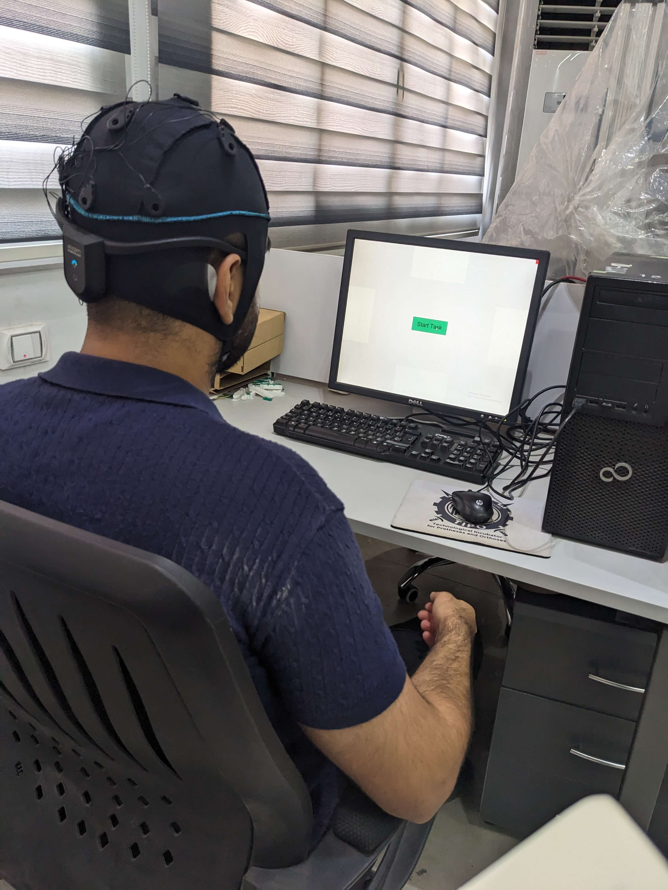
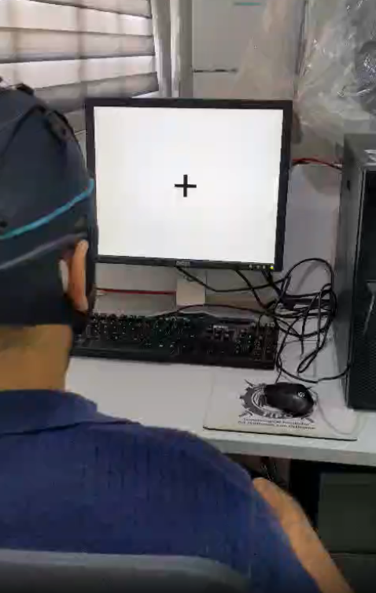

# EEG Motor Imagery Game Simulation and Custom Data Collection

This document describes the real-time simulation environment used for testing the Brain-Computer Interface (BCI) model and the protocol for the custom data collection experiment.

## 1. The Real-Time Simulation Game

To validate the model's real-world applicability, a simulation game was used where a user could control in-game actions using only their thoughts.

- **Objective**: The user's goal is to successfully navigate a game environment by dodging obstacles.
- **Control Mechanism**: The game is controlled by the user imagining either **left** or **right** hand movements. The `predict` function from the BCI model processes the live EEG data and sends a "left" or "right" command to the game engine to control the character's actions.
- **Live Demonstration**: A video demonstrating a team member playing the game in real-time is available in the `assets` folder. This video shows the user wearing the EEG headset and successfully controlling the game by thought alone.

click the video to play it.

## 2. Custom Data Collection Environment

A custom data collection experiment was conducted to gather user-specific EEG data. This data was intended to test the feasibility of fine-tuning the generalized model.

click the video to play.

### Experimental Protocol
- **Hardware**: An 8-channel **UNICORN HYBRID BLACK** wearable EEG headset was used for data acquisition.
- **User Training**: Before the experiment, the team member underwent a 30-minute training session to practice the motor imagery tasks.
- **Paradigm**: The data collection followed a structured trial-based paradigm:
    1.  **Initiation**: A cross appeared in the center of a 60 Hz screen for 2 seconds to signal the start of a trial.
    2.  **Cue**: An arrow was then displayed, pointing either left or right to indicate the direction for the motor imagery.
    3.  **Task**: The user imagined one of two movements with the cued hand: **handshaking** or **squeezing a stress ball**.
    4.  **Duration**: Each trial lasted for a total of 9 seconds.
