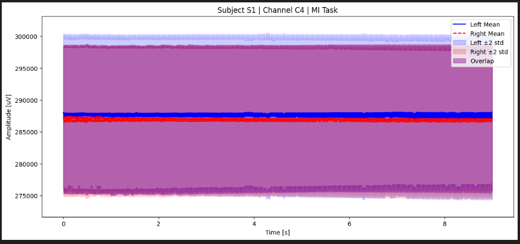
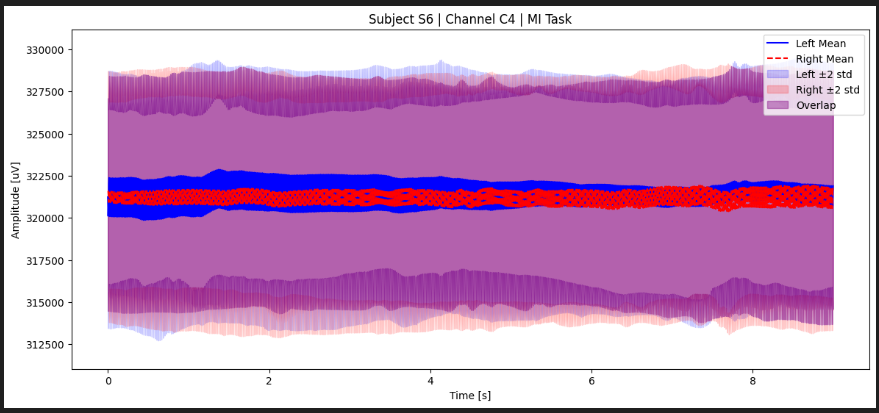
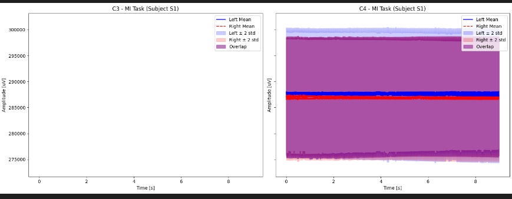
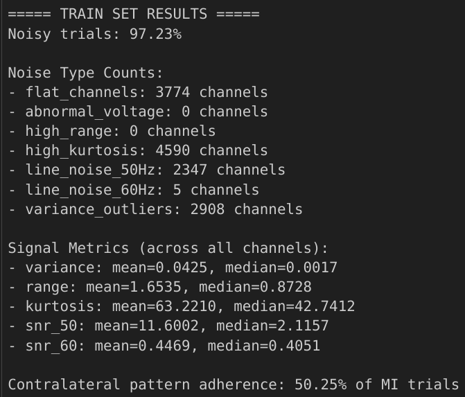
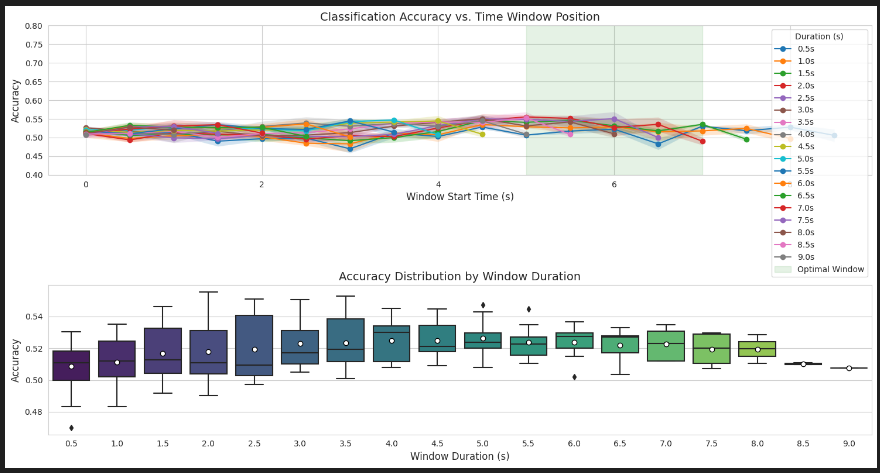
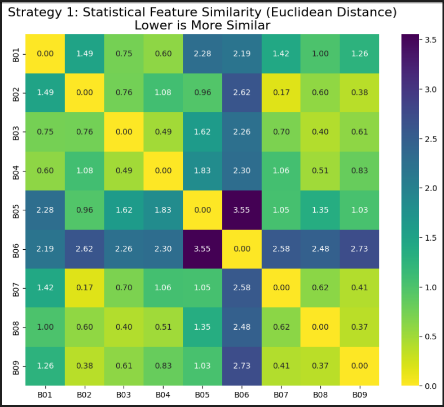
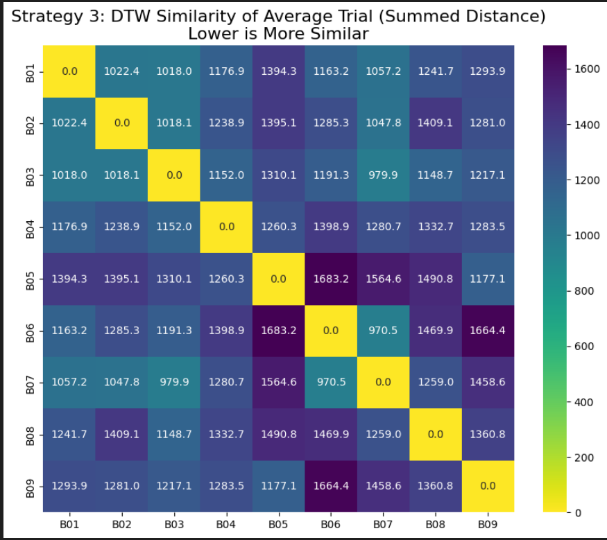

# Analysis of EEG Motor Imagery Data

This document summarizes the experiments and results from a series of Jupyter notebooks aimed at exploring, cleaning, and analyzing EEG data for a Motor Imagery (MI) task.

## 1. Data Exploration and Visualization

### Goal
The primary goal of the initial data exploration was to visually inspect the raw EEG signals to understand their fundamental characteristics, including inter-subject variability and differences between the two motor imagery classes ('Left' vs. 'Right' hand).

### Experiments and Results

#### Inter-Subject Variability
- **Experiment:** The EEG signal from the C3 channel for the first trial of the MI task was plotted for five different subjects.
- **Result:** The visualization highlighted significant differences in signal patterns and amplitudes between subjects. This confirms the high degree of inter-subject variability common in EEG data, reinforcing the need for subject-specific or adaptive models.

#### Class-Specific Signal Patterns
- **Experiment:** For a single subject, the average EEG signals for 'Left' and 'Right' hand MI tasks were plotted for channels C3 and C4. Additionally, the difference between C3 and C4 was plotted for both classes.
- **Result:**
    - Averaging the signals helped to reduce noise and reveal underlying patterns associated with the MI tasks.
    - The difference plot (C3 - C4) aimed to amplify the hemispheric asymmetries expected during motor imagery (i.e., ERD/ERS patterns). This visualization provided a clearer view of the physiological changes occurring in the motor cortex during the tasks.

## 2. Data Quality Inspection and Artifact Detection

### Goal
To systematically identify and quantify the presence of various artifacts in the raw EEG data to assess its quality and determine the necessity for a preprocessing pipeline.

### Experiments and Results

#### Artifact Analysis
- **Experiment:** The raw train, validation, and test datasets were inspected for a wide range of artifacts, including:
    - Flatlines
    - Abnormal Voltages
    - High Range (peak-to-peak amplitude)
    - High Kurtosis
    - Line Noise (50Hz and 60Hz)
    - Variance Outliers
    - Eyeblinks, Muscle Artifacts, and Drifts
- **Result:**
    - A staggering **100% of the raw trials** in all datasets were flagged as noisy.
    - The most prevalent issues were "abnormal_voltage" and "high_range," indicating significant contamination from muscle activity or other noise sources.
    - The results from the `inspection.ipynb` notebook provide a detailed breakdown of the percentage of trials affected by each type of artifact.

#### Impact of Preprocessing
- **Experiment:** A preprocessing pipeline involving robust scaling, bandpass filtering (1-40Hz), and notch filtering (50Hz) was applied to the data. The artifact inspection was then re-run.
- **Result:** After preprocessing, there was a dramatic reduction in detected artifacts, particularly in the "abnormal_voltage" and "high_range" categories. This demonstrates the effectiveness and necessity of the cleaning pipeline.

## 3. Identifying the Window of Interest

### Goal
To determine the most discriminative time segment within the 9-second motor imagery trials, which can improve classifier performance and reduce computational load.

### Experiments and Results

- **Experiment:** A sliding window approach was used. Different window durations (from 0.5s to 9.0s) were moved across the trial in steps of 0.5s. For each resulting window, a simple classifier was trained, and its accuracy was evaluated using cross-validation.
- **Result:**
    - The analysis generated a heatmap showing the classification accuracy for each combination of window start time and duration.
    - The optimal window was found to be **5.0 seconds long, starting at 3.0 seconds** into the trial. This window achieved the highest average accuracy of **0.57**.

## 4. Contralateral Pattern Verification

### Goal
To verify the presence of the expected physiological pattern of contralateral event-related desynchronization (ERD) in the mu-band, a key feature in motor imagery.

### Experiments and Results

- **Experiment:** The power in the C3 and C4 channels was compared for both left and right-hand imagery trials.
    - For left-hand imagery, C4 power was expected to be lower than C3.
    - For right-hand imagery, C3 power was expected to be lower than C4.
- **Result:** The expected contralateral pattern was observed in approximately **51.62%** of the MI trials. While this is better than chance, it indicates that this feature alone is not a perfectly reliable discriminator between the two classes.

## 5. Subject Uniqueness Analysis (on External Dataset)

### Goal
To demonstrate methods for verifying that EEG data from different subjects are unique, ensuring data integrity and preventing issues like mislabeled or duplicated subjects. (Note: This was performed on an external BCI dataset).

### Experiments and Results

- **Experiment:** Three different methods were used to compare data between subjects:
    1.  **Statistical Analysis:** Comparing features like mean, variance, skew, and kurtosis.
    2.  **Power Spectral Density (PSD) Analysis:** Comparing the "brain fingerprint" based on power in different frequency bands.
    3.  **Dynamic Time Warping (DTW):** Comparing the temporal shape of the average event-related potentials.
- **Result:** The notebook `similarity-with-external-dataset.ipynb` provides a framework and visualizations (e.g., similarity matrices) that can be used to quantify the similarity between subjects. A successful analysis would show low similarity scores between different subjects, confirming their uniqueness.

